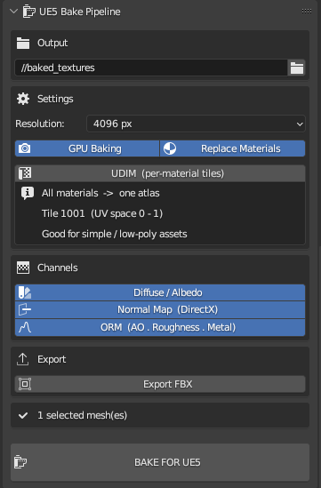
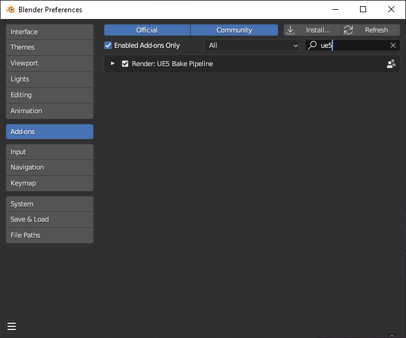
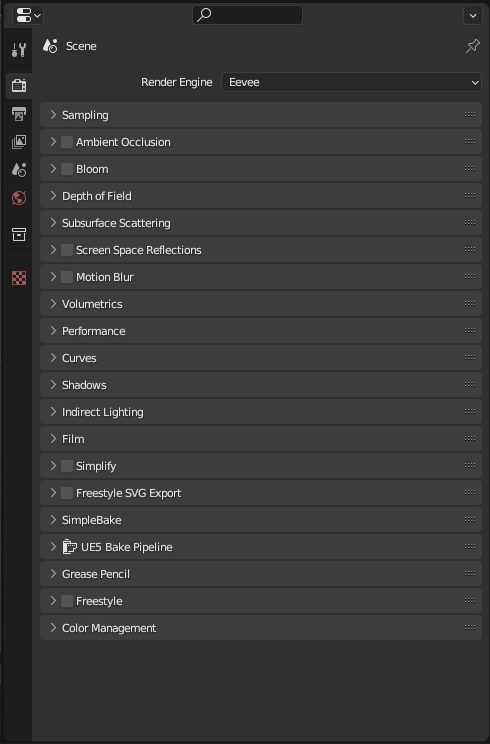
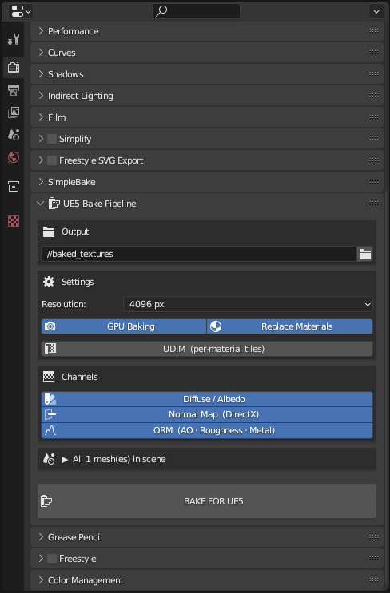
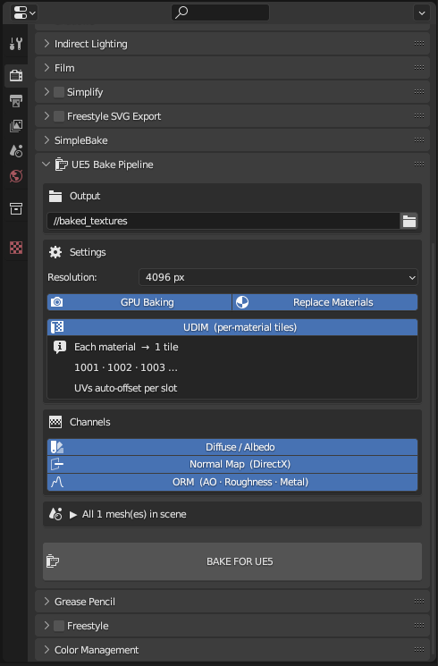
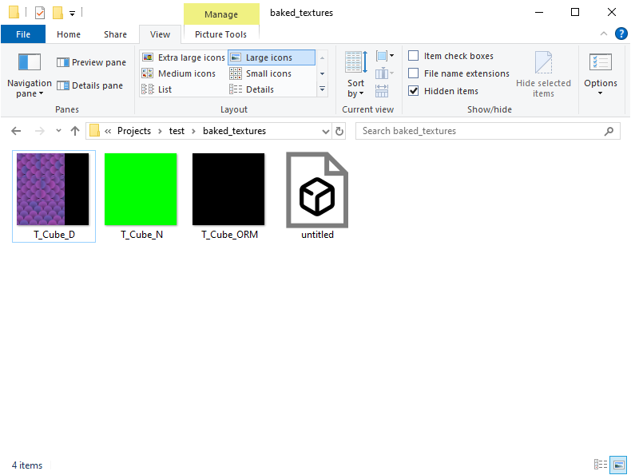
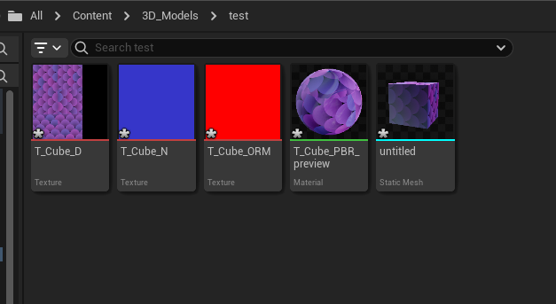
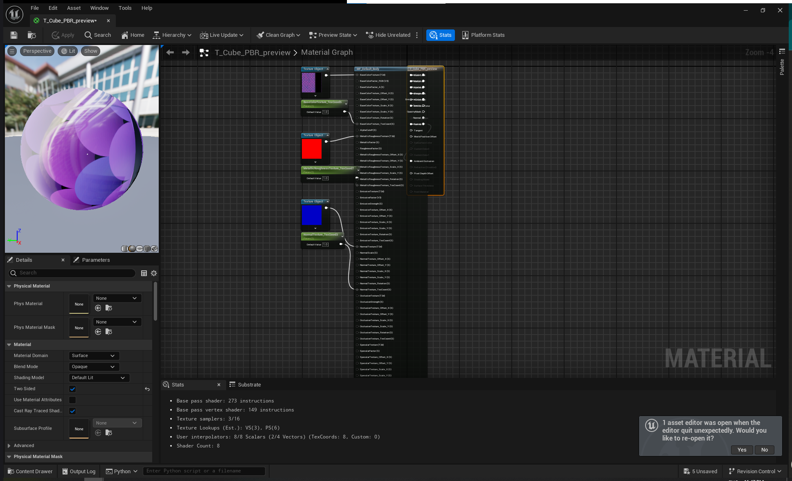
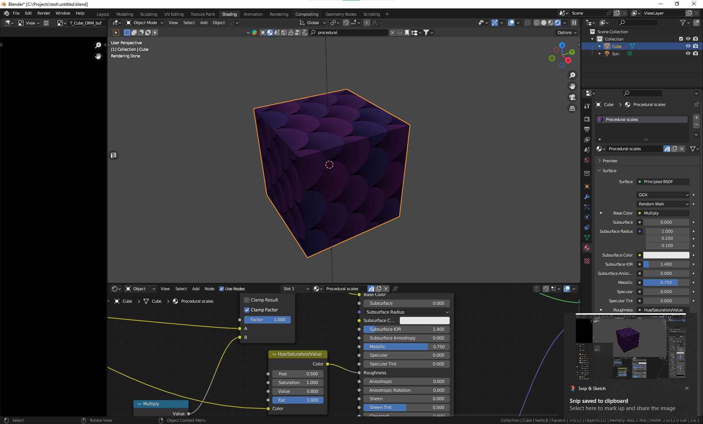
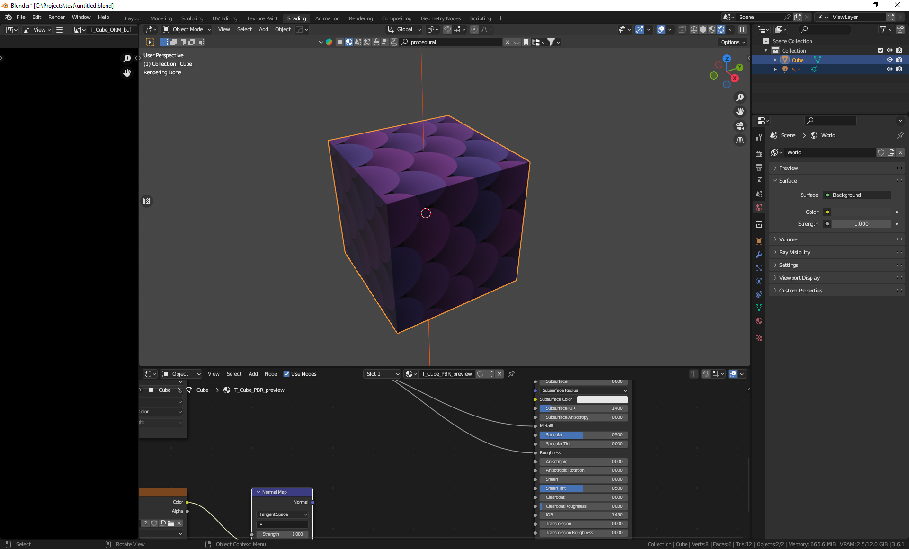

# UE5 Bake Pipeline — Blender Add-on

> **Dynart Interactive** · [github.com/DynartInteractive](https://github.com/DynartInteractive)  
> Version 1.0.0 · Blender 3.6 / 4.x · MIT License

Automatically UV-unwrap, bake, and export **Unreal Engine 5-ready PBR textures** directly from Blender — including UDIM support for hero assets, FBX export, and full procedural material compatibility. No lights required.

---

## Features

- **One-click bake pipeline** — Smart UV Project auto-unwrap + full PBR bake in a single operator
- **No lights required** — All channels bake via Emission pass, bypassing lighting entirely. Works on empty scenes
- **UE5-correct normals** — Normal maps automatically converted from Blender OpenGL (+Y) to Unreal Engine DirectX (-Y) with proper GPU→CPU pixel sync
- **ORM packing** — R=Ambient Occlusion · G=Roughness · B=Metallic packed into one texture, matching UE5's standard material layout
- **UDIM support** — Each material slot bakes into its own tile (1001, 1002, 1003 …) for maximum texel density on complex assets
- **Procedural material compatible** — Procedural node graphs evaluate in Object/Generated space, not UV space. No source material modification needed, even with UDIM enabled
- **FBX export** — Optional per-mesh FBX export with UE5-correct axis settings baked in (Forward: -X, Up: Z)
- **Status bar progress** — Live progress feedback in Blender's status bar with forced redraws between every bake step
- **Safe path handling** — Detects unsaved `.blend` files before attempting relative path writes, with clear actionable error messages
- **Preview material** — Optionally replaces procedural materials with a clean Principled PBR material after baking

---

## Installation

1. Download `ue5_bake_pipeline.py` from the [latest release](https://github.com/DynartInteractive/ue5-bake-pipeline/releases/latest)
2. Open Blender → `Edit → Preferences → Add-ons → Install`
3. Select the downloaded `.py` file
4. Enable **"Render: UE5 Bake Pipeline"** in the add-on list

The panel appears in **Properties → Render → UE5 Bake Pipeline**.

---

## Panel Reference

The panel lives in the **Properties editor → Render tab**. Click the header to expand.

### Settings

| Setting | Description |
|---|---|
| Output Folder | Directory where PNG and FBX files are saved. Supports `//` relative paths (requires saved `.blend`) |
| Resolution | Per-tile bake resolution: 1024 / 2048 / 4096 / 8192 px |
| GPU Baking | Use GPU (faster). Disable if you hit VRAM limits |
| Replace Materials | After baking, swap procedural materials with a PBR preview material |
| UDIM | Per-material tile layout — see UDIM section below |

### Channels

| Channel | Output | Notes |
|---|---|---|
| Diffuse / Albedo | `T_Name_D.png` | Baked via Emission — no lighting needed |
| Normal Map (DirectX) | `T_Name_N.png` | OpenGL→DirectX conversion applied automatically |
| ORM | `T_Name_ORM.png` | R=AO · G=Roughness · B=Metallic packed |

### Export

| Setting | Description |
|---|---|
| Export FBX | Export each processed mesh as `MeshName.fbx` to the output folder. Axis settings pre-configured for UE5 |

---

## Usage

### Basic workflow

1. Open your scene with procedural materials
2. Select the mesh objects you want to bake  
   *(or select nothing — all meshes in the scene are processed)*
3. Set your **Output Folder**
4. Choose **Resolution** (4096 recommended for hero assets)
5. Toggle channels and options as needed
6. Click **BAKE FOR UE5**

Progress is shown live in Blender's status bar at the bottom of the screen.

---

### UDIM mode

Enable **UDIM** to bake each material slot into its own tile. UVs are automatically offset per slot — no manual UV work needed.

> **Procedural materials and UDIM:**  
> Procedural node graphs evaluate surface values using Object or Generated coordinate space — they never read UV coordinates. UDIM baking works perfectly with procedural materials without any modification. The tile layout only affects the bake *target* image, not the source material.

| | UDIM ON | UDIM OFF |
|---|---|---|
| UV layout | Each material slot → own tile | All materials → shared 0–1 space |
| Output files | `T_Name_D.1001.png`, `T_Name_D.1002.png` … | `T_Name_D.png` |
| Texel density | High — full resolution per material | Shared across all materials |
| Best for | Hero assets, complex multi-material meshes | Simple props, background assets |
| Procedural compatible | ✔ Yes | ✔ Yes |

---

### Output files

| File | Content | UE5 Compression |
|---|---|---|
| `T_Name_D.png` | Diffuse / Albedo | sRGB ON · Default |
| `T_Name_N.png` | Normal map (DirectX) | sRGB OFF · Normal Map |
| `T_Name_ORM.png` | AO · Roughness · Metallic | sRGB OFF · Masks |
| `MeshName.fbx` | Mesh geometry (optional) | — |

---

### UE5 import

1. Drag the PNG files into your UE5 Content Browser
2. Apply the import settings from the table above per texture type
3. For UDIM textures, enable **"Import as UDIM"** in the import dialog

4. In your UE5 Material graph, connect:
   - `T_*_D` → **Base Color**
   - `T_*_N` → **Normal** (via TextureSample → Normal Map node)
   - `T_*_ORM` → unpack with **BreakOutFloat3Components** or **ComponentMask**:
     - R → **Ambient Occlusion**
     - G → **Roughness**
     - B → **Metallic**

---

### Before / After

Procedural material in Blender → baked PBR result in UE5:

---

## Technical Notes

### Why no lights are needed
All channels — including Diffuse — are baked using the Emission trick: the source socket (e.g. Base Color, Metallic) is temporarily wired into an Emission node connected to the Material Output. Baking `EMIT` captures the raw value at the surface hit point with no ray bouncing or lighting math. The original node tree is fully restored after each channel.

### Normal map conversion
Blender bakes tangent-space normals in OpenGL convention (+Y = up in UV space). UE5 expects DirectX convention (-Y = up). The Green channel is inverted after baking. A GPU→CPU pixel buffer sync (`img.update()` + forced pixel read) is performed before the numpy operation to prevent reading stale GPU data, which would otherwise produce a fully green normal map.

### Metallic bake
Blender has no native `METALLIC` bake type. The same Emission trick used for Diffuse is applied, wiring the Metallic socket through Emission and baking `EMIT` as a grayscale map.

### ORM packing
AO, Roughness, and Metallic are baked as separate intermediate images, then combined into a single ORM texture using numpy pixel array manipulation. Intermediate images are kept in Blender memory but only the final packed ORM is saved to disk.

---

## Known Limitations

- **Source shader requirement** — Materials must have a Principled BSDF node. Custom group nodes that don't expose a Principled BSDF may produce empty Metallic or Diffuse maps
- **Blender preview normal** — The preview material uses the DirectX-converted normal map. A slight shading difference in Blender's viewport is expected and correct — the UE5 result is accurate
- **UDIM tile count** — Up to 10 material slots per V-row (tiles 1001–1010). More than 10 wraps to V-row 1 (tiles 1011+), fully supported
- **Relative output path** — Using `//` requires the `.blend` file to be saved first. The panel shows a warning and the operator cancels with a clear message if this condition is not met

---

## Requirements

- Blender **3.6** or **4.x**
- **Cycles** render engine (set automatically)
- Materials using **Principled BSDF** as the main shader
- `numpy` — included with Blender's bundled Python

---

## License

MIT License — free to use, modify, and distribute. Attribution appreciated.  
See [LICENSE](LICENSE) for full text.

---

## Credits

Developed by **Z3r0C00l** / [Dynart Interactive](https://github.com/DynartInteractive)
https://buymeacoffee.com/z3r0c00l

---

## Changelog

### v1.0.0 — Initial Release
- Diffuse, Normal (DirectX), ORM bake channels
- All channels baked via Emission pass — no scene lights required
- GPU→CPU pixel sync fix — prevents fully green normal maps
- UDIM per-material tile support with auto UV offset
- Procedural material compatibility (Object/Generated space)
- FBX export with UE5-correct axis settings (Forward: -X, Up: Z)
- Status bar live progress with forced redraws between bake steps
- Safe path handling — detects unsaved `.blend` on relative output paths
- `poll()` gate — bake button greyed out when preconditions not met
- `REGISTER + UNDO` operator — full undo stack support
- WinError 5 fix — permission error caught with actionable message
